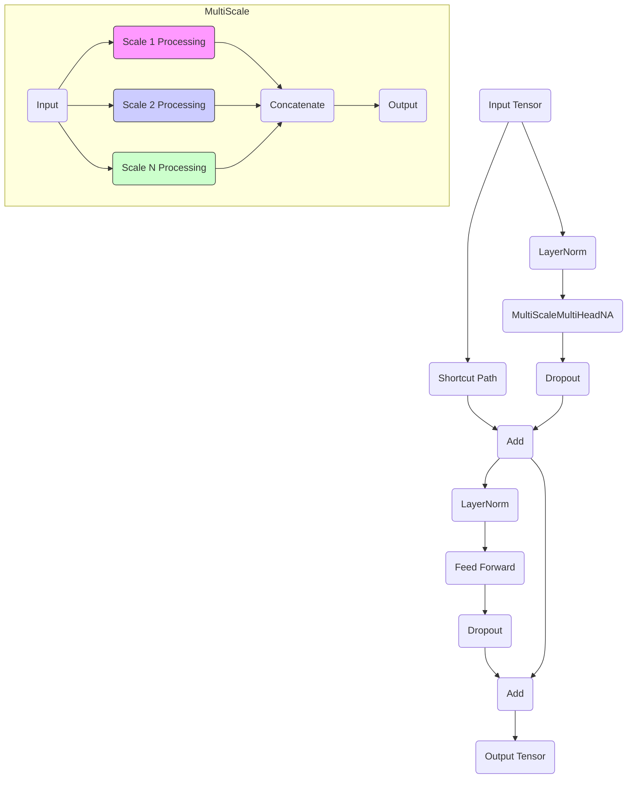
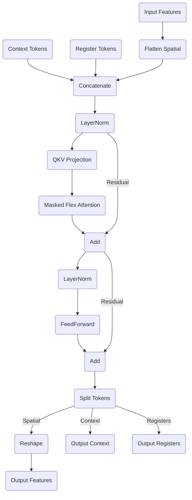

# Research Paper Proposal: EyeToy

**Title:** EyeToy: Achieving Efficient Global Vision Context through Multi-Scale Neighborhood Attention

**Authors:** \[Your Name/Lab Here]

**Date:** \[Current Date]

**1. Abstract**

Vision Transformers (ViTs) have demonstrated remarkable success, but standard self-attention suffers from quadratic complexity, limiting high-resolution applicability. Window-based mechanisms (e.g., Swin, NAT) reduce complexity but often struggle with efficient long-range dependency capture. We propose EyeToy, a novel vision transformer architecture centered around the Multi-Scale Neighborhood Attention Transformer (MSNAT). MSNAT processes features concurrently at multiple spatial scales using parallel groups of neighborhood attention heads with distinct configurations (attention windows, convolutional token merging). This allows simultaneous capture of fine-grained local details and coarser-grained context within a single layer. EyeToy further integrates an efficient O(N) global context mechanism using register and context tokens. This dual approach enables powerful representations modeling both local and global interactions with linear complexity. Preliminary experiments on a shallow (4-block, 3M parameter) MSNAT-only variant (without the dedicated global attention stack) show promising results on CIFAR-10 (89% Top-1), CIFAR-100 (69% Top-1, 94% Top-5), and Caltech-256 (50% Top-1, 70% Top-5) trained from scratch, achieving performance comparable to larger models without pretraining and demonstrating stable training dynamics without gradient clipping. We hypothesize the full EyeToy architecture will achieve competitive or superior performance against state-of-the-art models on standard benchmarks (ImageNet, COCO, ADE20K) while offering significant efficiency improvements.

**2. Introduction**

The success of Transformers in NLP spurred their adaptation to computer vision (Dosovitskiy et al., 2020). ViTs excel but face quadratic scaling issues due to global self-attention. This hinders application to high-resolution inputs common in vision tasks.

Mitigation strategies like Swin Transformer's shifted windows (Liu et al., 2021) and Neighborhood Attention (NAT) (Hassani et al., 2023) restrict attention locally, achieving linear complexity. However, propagating global information often requires multiple layers or specialized mechanisms, potentially delaying long-range modeling. Convolutional models like ConvNeXt (Liu et al., 2022) are efficient but may lack attention's dynamic modeling capacity.

We identify a need for architectures efficiently capturing local details and global context *simultaneously* within each layer. We propose EyeToy, featuring the Multi-Scale Neighborhood Attention Transformer (MSNAT). MSNAT uses parallel attention head groups within one block, each with different parameters (e.g., convolutional strides/kernels for tokenization, NAT window sizes) creating multiple simultaneous receptive fields. This allows the model to "see" at different scales concurrently – fine details via small windows/strides, broader context via larger ones – within the *same layer*.

Furthermore, EyeToy incorporates an O(N) global context refinement mechanism inspired by DINOv2 (Oquab et al., 2023), using learnable register tokens and a dedicated context token interacting with all spatial tokens via a specialized `GlobalAttentionTransformer`. This provides a direct pathway for global information aggregation without quadratic cost.

Initial experiments with a simplified, shallow (4-block, 3M parameter) MSNAT-only model (using global average pooling instead of the `GlobalAttentionStack`) trained from scratch yielded promising results: 89% Top-1 on CIFAR-10 (30 epochs), 69% Top-1 / 94% Top-5 on CIFAR-100 (50 epochs), and 50% Top-1 / 70% Top-5 on Caltech-256 (50 epochs). These results, achieved without pretraining or gradient clipping, are comparable to larger models and validate the core MSNAT concept's effectiveness and efficiency. This motivates the investigation of the full EyeToy architecture with added depth and the explicit global mechanism.

**Our key contributions are:**

1. **Multi-Scale Neighborhood Attention (MSNAT):** A novel attention mechanism processing information at multiple spatial scales concurrently within a single block using parallel neighborhood attention head groups with diverse configurations.
2. **EyeToy Architecture:** An efficient vision transformer backbone integrating MSNAT layers with an O(N) global context mechanism (register/context tokens) for comprehensive feature extraction.
3. **Linear Complexity:** Demonstrating an architecture effectively modeling local and global context while maintaining linear computational complexity.
4. **Empirical Validation:** Extensive experiments on benchmark datasets (ImageNet, COCO, ADE20K) to validate EyeToy's performance and efficiency against state-of-the-art models, supported by strong preliminary findings.

**3. Related Work**

* **Vision Transformers (ViT):** Patch-based global self-attention (Dosovitskiy et al., 2020). Quadratic complexity.
* **Windowed/Local Attention:**
  * *Swin Transformer:* Windowed attention with shifted windows (Liu et al., 2021). Linear complexity, relies on shifting.
  * *Neighborhood Attention (NAT) / NATTEN:* Attention within local neighborhoods (Hassani et al., 2023). Efficient locally, requires stacking. EyeToy extends NAT with intra-layer multi-scaling.
* **Hierarchical Transformers:** Swin, PVT (Wang et al., 2021) build hierarchical maps. EyeToy's MSNAT performs multi-scaling *within* stages.
* **Multi-Scale Mechanisms:** CNNs use pooling/strides. Some transformers use feature pyramids (MViT - Fan et al., 2021). MSNAT uses *simultaneous* multi-scale attention computation within a block.
* **Global Context Tokens/Registers:** Class Attention (Caron et al., 2021), Register tokens (Oquab et al., 2023) improve features/stability. EyeToy uses them for efficient global refinement.
* **Convolutional Models:** ConvNeXt (Liu et al., 2022) offers efficiency. EyeToy combines NAT's local efficiency with attention's dynamics, enhanced by multi-scaling and global tokens.

EyeToy differentiates via *simultaneous* multi-scale processing in MSNAT layers and its combination of efficient local attention with a dedicated linear-complexity global attention mechanism.

**4. Proposed Method: EyeToy**

Built upon `Encoder` modules (`Encoder1D/2D/3D`): initial Conv projection -> `TransformerStack` -> `GlobalAttentionStack`.

**4.1. Multi-Scale Neighborhood Attention Transformer (MSNATTransformer)**

Core block (`MSNATTransformer1D/2D/3D`) using `MultiScaleMultiHeadNA` attention.

* **Multi-Scale Multi-Head Neighborhood Attention (`MultiScaleMultiHeadNA`):**

  * Input: \( x \in \mathbb{R}^{B \times C_{in} \times ...} \).
  * Contains multiple attention head groups (list of `HeadParams`).
  * Each `HeadParams` specifies:
    * `conv_params`: Group-specific Conv parameters (kernel, stride) for tokenization. Varying strides create different resolutions.
    * `attn_params`: Group-specific `attention_window` for `NA` computation (using `na1d/na2d/na3d`).
    * `num_heads`, `intermediate_channels`.
  * Input `x` processed *in parallel* by each group's tokenizer (`SharedScaleNA.tokenizer`) and QKV projection (`SharedScaleNA.qkv_proj`).
  * Neighborhood attention (`NA`) computed per group using its `attention_window`.
  * Outputs potentially resized (interpolation) and concatenated channel-wise.
  * Final projection (`MultiScaleMultiHeadNA.out_proj`) mixes scales and projects to `C_out`.
* **MSNATTransformer Block:** Integrates `MultiScaleMultiHeadNA` in standard structure:

  ```
  x_shortcut = Shortcut(Rescale(x))
  x = x + MultiScaleMultiHeadNA(LayerNorm1(x))
  x = x + FFN(LayerNorm2(x))
  ```

  * `scale_factor` in `TransformerParams` controls optional spatial downsampling.

**4.2. Global Attention Stack (`GlobalAttentionStack`)**

Refines global context efficiently after `TransformerStack`.

* Multiple layers of `GlobalAttentionTransformer`.
* Introduces learnable `register_tokens` (`num_register_tokens`) and optional `context_token`.
* Input: Feature map `x` (flattened) concatenated with context/register tokens.
* **Attention Mechanism:** Uses `flex_attention` with mask (`create_attention_mask`):
  * Register/context tokens attend to each other and all spatial tokens.
  * Spatial tokens attend to themselves *and* register/context tokens.
  * *No* direct attention between spatial tokens (avoids quadratic cost).
* Aggregates global info into context/register tokens, broadcasts back to spatial tokens (O(N)).
* Output: Refined spatial feature map and final context token.

**4.3. Architecture Overview (`Encoder`)**

1. **Initial Projection:** Input -> `initial_proj` (Conv).
2. **Positional Embedding:** Add sinusoidal embeddings (`PositionalEmbedding1D/2D/3D`).
3. **Transformer Stack:** Process via `MSNATTransformer` blocks (refine features, multi-scale processing within blocks, optional downsampling).
4. **Global Attention Stack:** Refine global context using register/context tokens.
5. **Output:** Final spatial features and global context token.

**4.4. Complexity Analysis**

* **MSNAT:** NATTEN complexity is O(N * k^d). Parallel groups maintain linear O(N).
* **GlobalAttentionTransformer:** Attention is O(N*R + R^2) = O(N) assuming R << N spatial tokens.
* **Overall:** EyeToy maintains O(N) complexity.

**4.5. Visualization of Attention Mechanisms**

To better illustrate the core components, the following diagrams visualize the data flow within the MSNAT block and the Global Attention mechanism.

***Multi-Scale Neighborhood Attention (MSNAT) Block Flow:***

This diagram shows how an input tensor flows through a single `MSNATTransformer` block. The key component is the `MultiScaleMultiHeadNA` module, which processes the input in parallel across different spatial scales.



*   **Parallel Head Groups:** The input is processed by multiple parallel groups.
*   **Tokenization:** Each group uses a distinct convolution (`Conv k, s`) to potentially change resolution and tokenize features.
*   **Neighborhood Attention (NA):** Each group applies Neighborhood Attention with its specific window size (`NA win`).
*   **Resizing & Concatenation:** Outputs from different scales are resized to a common dimension (usually the input dimension before concatenation) and combined channel-wise.
*   **Final Projection:** A final convolution mixes information across scales.

***Global Attention Transformer Flow:***

This diagram illustrates the flow within a single `GlobalAttentionTransformer` layer, used in the `GlobalAttentionStack`. It highlights the interaction between spatial features and the context/register tokens.



*   **Token Concatenation:** Spatial features are flattened and concatenated with learnable (or input) context and register tokens.
*   **Masked Attention:** `flex_attention` is used with a specific mask:
  * Context and Register tokens attend to all other tokens (context, registers, and all spatial tokens).
  * Spatial tokens attend only to themselves *and* the context/register tokens.
  * Crucially, spatial tokens **do not** attend to other spatial tokens, maintaining O(N) complexity.
* **Output:** The layer outputs refined spatial features, an updated context token, and updated register tokens.

**5. Experiments**

**5.1. Preliminary Results (Shallow MSNAT-only Model)**

As mentioned, early experiments were conducted on a simplified EyeToy variant consisting of only 4 `MSNATTransformer` blocks (4 head groups, 2 heads each, 8 total heads per block) and approximately 3M parameters. This version omitted the `GlobalAttentionStack`, using simple Global Average Pooling after the transformer stack for classification. Training was performed from scratch (no pretraining) using AdamW and standard augmentations appropriate for each dataset. Notably, training was stable without requiring gradient clipping.

| Dataset     | Train Acc. | Top-1 Test Acc. | Top-5 Test Acc. | Epochs | Model Size | Notes                                    |
| :---------- | :--------- | :-------------- | :-------------- | :----- | ---------- | :--------------------------------------- |
| CIFAR-10    | ~90%       | ~89%            | -               | 30     | 3M         | Comparable to larger models              |
| CIFAR-100   | ~91%       | ~69%            | ~94%            | 50     | 3M         | Strong Top-5                             |
| Caltech-256 | ~80%       | ~50%            | ~70%            | 50     | 3M         | Suggests benefit from depth/global stack |
| Imagenet-1k | ~33%       | ~42%            | ~67%            | 9      | 35M        | Suggests scalability                     |

These preliminary results demonstrate the core MSNAT mechanism's effectiveness and efficiency, forming a strong baseline and motivating the evaluation of the full, deeper architecture with the explicit global attention mechanism.

**5.2. Planned Experiments (Full EyeToy)**

* **Datasets and Tasks:**
  * Image Classification: ImageNet-1K (Deng et al., 2009).
  * Object Detection & Instance Segmentation: COCO (Lin et al., 2014).
  * Semantic Segmentation: ADE20K (Zhou et al., 2017).
* **Baselines:**
  * ViT (Dosovitskiy et al., 2020)
  * Swin Transformer (Liu et al., 2021)
  * Neighborhood Attention Transformer (NAT) (Hassani et al., 2023)
  * ConvNeXt (Liu et al., 2022)
  * Other relevant SOTA models (task-dependent).
* **Evaluation Metrics:**
  * Classification: Top-1, Top-5 Accuracy.
  * Detection: AP, AP50, AP75.
  * Segmentation: mIoU.
  * Efficiency: FLOPs, Parameter Count, Throughput (images/sec).
* **Implementation Details:**
  * PyTorch implementation using NATTEN library.
  * Standard training protocols (AdamW, schedulers, data augmentation).
  * Explore EyeToy model sizes (Tiny, Small, Base) similar to baselines.
  * Integrate EyeToy backbone into standard detection/segmentation frameworks (Mask R-CNN, UperNet).
  * Training stability observed without gradient clipping in preliminary runs will be monitored.
* **Ablation Studies:**
  * **Impact of Multi-Scale:** Compare MSNAT vs. single-scale NAT within EyeToy (using preliminary results as one data point).
  * **Impact of Global Attention Stack:** Compare full EyeToy vs. MSNAT-only (using preliminary results as baseline).
  * **Role of Register Tokens:** Vary `num_register_tokens`.
  * **Attention Window Sizes:** Analyze effect of different `attention_window` choices.
  * **Token Merging Strategy:** Evaluate different `conv_params` in MSNAT tokenizers.
  * **Comparison to NAT Paper:** Compare against published NAT results and NAT reimplemented in our framework.

**6. Expected Outcomes and Impact**

We expect the full EyeToy architecture to:

1. **Strong Performance:** Achieve performance competitive with or exceeding SOTA ViTs and CNNs on ImageNet, COCO, and ADE20K, building upon the promising preliminary results.
2. **Superior Efficiency:** Exhibit significantly lower FLOPs/higher throughput compared to global attention ViTs, and potentially favorable efficiency compared to other linear-complexity transformers due to integrated global context and simultaneous multi-scale processing.
3. **Effective Context Modeling:** Ablations will confirm benefits of both MSNAT and the `GlobalAttentionStack`. The gap between preliminary (MSNAT-only) and full model results will highlight the global stack's contribution.

Impact: Introduce MSNAT as an effective, efficient attention mechanism. EyeToy provides a blueprint for vision backbones balancing multi-scale local features and efficient global context, benefiting high-resolution or real-time applications. The demonstrated stability without gradient clipping is an additional practical advantage.

**7. Timeline (Approximate)**

* **Months 1-2:** Finalize full EyeToy implementation, set up baselines.
* **Months 3-4:** Conduct ImageNet classification experiments and ablations.
* **Months 5-6:** Implement/run COCO detection/segmentation experiments.
* **Months 7-8:** Implement/run ADE20K segmentation experiments. Analyze results.
* **Months 9-10:** Write paper draft.
* **Months 11-12:** Refine paper, submit to top-tier CV conference (CVPR, ICCV, ECCV, NeurIPS).

**8. References**

* Caron, M., et al. (2021). Emerging Properties in Self-Supervised Vision Transformers. *ICCV*.
* Deng, J., et al. (2009). ImageNet: A large-scale hierarchical image database. *CVPR*.
* Dosovitskiy, A., et al. (2020). An Image is Worth 16x16 Words: Transformers for Image Recognition at Scale. *ICLR 2021*.
* Fan, H., et al. (2021). Multiscale Vision Transformers. *ICCV*.
* Hassani, A., et al. (2023). Neighborhood Attention Transformer. *CVPR*.
* Kay, W., et al. (2017). The Kinetics Human Action Video Dataset. *arXiv:1705.06950*.
* Lin, T. Y., et al. (2014). Microsoft COCO: Common Objects in Context. *ECCV*.
* Liu, Z., et al. (2021). Swin Transformer: Hierarchical Vision Transformer using Shifted Windows. *ICCV*.
* Liu, Z., et al. (2022). A ConvNet for the 2020s. *CVPR*.
* Oquab, M., et al. (2023). DINOv2: Learning Robust Visual Features without Supervision. *arXiv:2304.07193*.
* Wang, W., et al. (2021). Pyramid Vision Transformer: A Versatile Backbone for Dense Prediction without Convolutions. *ICCV*.
* Zhou, B., et al. (2017). Scene Parsing through ADE20K Dataset. *CVPR*.
* \[Link to NATTEN GitHub/Paper]
