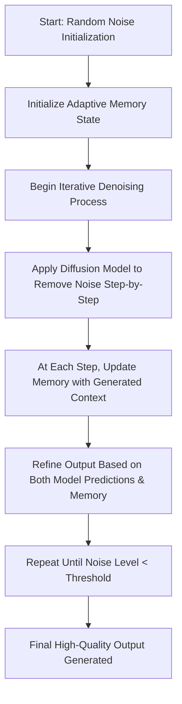

# Simulation and Generation: Training, Inference, and Interactive Overview

## Introduction

Our framework for simulation and generation combines two powerful components:

1.**Diffusion-Based Generative Modeling:**

   The model learns to transform random noise into structured outputs through an iterative denoising process. It works across various dimensions (1D, 2D, and 3D) and is designed to capture both fine-grained textures and expansive global structures.

2.**Adaptive Hierarchical Memory (Pluto):**

   This module introduces persistent memory that adapts over time. By storing context from previous generation steps, the system ensures that new content remains coherent with past outputs, allowing the virtual environment to evolve naturally.

Together, these components enable the procedural generation and simulation of complex, dynamically evolving environments – ideal for applications such as game world creation, interactive simulations, and digital art installations.

---

## Training Process

### Overview

The training process teaches the diffusion model to reverse a forward noise corruption process applied to clean data samples. Simultaneously, the adaptive memory system is trained to capture and update context so that the model can maintain long-term consistency. This complex training paradigm is divided into two complementary stages:

1.**Diffusion Model Training:**

   -**Forward Process:** Clean data (images, volumes, etc.) is progressively corrupted by adding noise over a series of timesteps.

   -**Reverse Process:** The diffusion model learns to predict and remove this noise gradually, reconstructing the original data.

   -**Loss Function:** The Mean Squared Error (MSE) between the predicted denoised output and the actual clean data is typically used, ensuring that the model accurately learns the denoising trajectory.

2.**Adaptive Memory Training:**

   -**Context Capture:** The memory module observes state transitions during the diffusion denoising process.

   -**Memory Update:** Through gating and sparse updates, the module learns to store essential features (context tokens) and quickly adjust when novel inputs are encountered.

   -**Alignment:** A secondary loss function ensures that the updated memory aligns with the ground truth context from intact data, reinforcing long-term consistency.

### Diagram – Training Process

```mermaid

flowchart TD

    A[Start: Clean Data Sample] --> B[Forward Diffusion Process]

    B --> C[Gradually Add Noise over Timesteps]

    C --> D[Obtain Noisy Data Sample at Random Timestep]

    D --> E[Diffusion Model Predicts Noise Reduction]

    E --> F[Compute Loss (e.g., MSE) between Prediction and Clean Sample]

    F --> G[Backpropagation to Update Diffusion Parameters]

    G --> H[Simultaneously, Adaptive Memory Captures Context]

    H --> I[Memory Module Updates via Sparse Gating Mechanisms]

    I --> J[End of Training Iteration]

```

### Training Details

-**Noise Schedule:**

  A predefined schedule governs the noise addition process, ensuring the model encounters various levels of degradation.

-**Batch Iterations:**

  In every iteration, a batch of clean samples is processed, updating both the diffusion model and adaptive memory simultaneously for end-to-end coherence.

-**Multi-Dimensional Training:**

  The model supports 1D, 2D, and 3D data through dimension-specific diffusion blocks while sharing a common architectural backbone, allowing cross-domain expertise.

-**Memory Alignment Loss:**

  An auxiliary loss term is used to keep the adaptive memory aligned with context from clean sequences, which is crucial for sustaining long-term consistency.

---

## Inference Process

### Overview

During inference, the system reverses the diffusion process to generate new content from random noise. The adaptive memory module injects contextual awareness into the generation process, leading to stable and consistent outputs.

1.**Initialization:**

   -**Noise Generation:** Start with a random noise sample.

   -**Memory Bootstrapping:** The adaptive memory is initialized with a learned baseline context to guide the denoising sequence.

2.**Iterative Denoising:**

- The diffusion model is applied iteratively to gradually remove noise.
- At each step, the memory module updates based on recent outputs, ensuring the evolving content remains consistent with the simulation’s history.

3.**Final Output Generation:**

- Once the noise has been sufficiently reduced (below a set threshold), the process concludes.
- The final high-fidelity output is both visually coherent and contextually aligned with previous states.

### Diagram – Inference Process



### Inference Details

-**Iterative Reverse Diffusion:**

  The process gradually removes noise, with each iteration bringing the generated sample closer to a clean, coherent state.

-**Memory-Assisted Refinement:**

  Throughout the process, the adaptive memory continually refines the output by reintroducing contextual features, thereby preserving important visual or structural details.

-**Real-Time Adaptation:**

  In scenarios such as interactive simulations, the system can adapt in real time, handling unexpected inputs or environmental changes swiftly.

-**Controlled Generation:**

  With support for conditional inputs, the system can tailor the generation process towards specific themes or styles, ideal for interactive content creation.

---

## Interactive Aspects

### Engaging with the Generation Process

Our framework is designed to support interactive applications, where user input and real-time feedback help guide the generative process:

-**User-Driven Input:**

  The system can receive real-time adjustments, such as style preferences, thematic directions, or corrections. This input influences the diffusion process, enabling the model to generate content that aligns closely with user intent.

-**Adaptive Memory Feedback Loop:**

  As users interact with the system, the adaptive memory updates its stored context. This ensures that subsequent outputs incorporate user guidance, maintaining continuity and coherence while dynamically evolving with the interaction.

-**Interactive Simulation Environments:**

  Ideal for game world creation, virtual simulations, or digital art installations, the framework supports interactive scenarios where the generated environment responds to user actions—leading to an ever-evolving and persistently engaging experience.

### Diagram – Interactive Feedback Loop


### Practical Benefits

-**Real-Time Responsiveness:**

  The system can modify its outputs on-the-fly in response to interactive cues, making it highly suitable for evolving simulations and gaming applications.

-**Enhanced Creativity:**

  By integrating user contributions, the generative process becomes a collaborative effort, harnessing both algorithmic capability and human creativity.

-**Stability with Flexibility:**

  Combining adaptive memory with interactive inputs ensures that while the system remains stable and contextually aware, it is also flexible enough to adapt to new directions instantly.

---

## Conclusion

Our integrated approach to simulation and generation—merging diffusion-based iterative denoising with an adaptive memory system—provides a robust solution for generating high-quality, temporally consistent content. With the added emphasis on interactive aspects, the system is uniquely positioned to support dynamic, real-time applications, ranging from immersive game worlds to responsive digital art installations.

By understanding the training process, the inference strategy, and the interactive feedback mechanisms through our detailed explanations and visual diagrams, stakeholders can fully appreciate the sophistication, flexibility, and potential of this unified generative framework.

<style>#mermaid-1743689690228{font-family:sans-serif;font-size:16px;fill:#333;}#mermaid-1743689690228 .error-icon{fill:#552222;}#mermaid-1743689690228 .error-text{fill:#552222;stroke:#552222;}#mermaid-1743689690228 .edge-thickness-normal{stroke-width:2px;}#mermaid-1743689690228 .edge-thickness-thick{stroke-width:3.5px;}#mermaid-1743689690228 .edge-pattern-solid{stroke-dasharray:0;}#mermaid-1743689690228 .edge-pattern-dashed{stroke-dasharray:3;}#mermaid-1743689690228 .edge-pattern-dotted{stroke-dasharray:2;}#mermaid-1743689690228 .marker{fill:#333333;}#mermaid-1743689690228 .marker.cross{stroke:#333333;}#mermaid-1743689690228 svg{font-family:sans-serif;font-size:16px;}#mermaid-1743689690228 .label{font-family:sans-serif;color:#333;}#mermaid-1743689690228 .label text{fill:#333;}#mermaid-1743689690228 .node rect,#mermaid-1743689690228 .node circle,#mermaid-1743689690228 .node ellipse,#mermaid-1743689690228 .node polygon,#mermaid-1743689690228 .node path{fill:#ECECFF;stroke:#9370DB;stroke-width:1px;}#mermaid-1743689690228 .node .label{text-align:center;}#mermaid-1743689690228 .node.clickable{cursor:pointer;}#mermaid-1743689690228 .arrowheadPath{fill:#333333;}#mermaid-1743689690228 .edgePath .path{stroke:#333333;stroke-width:1.5px;}#mermaid-1743689690228 .flowchart-link{stroke:#333333;fill:none;}#mermaid-1743689690228 .edgeLabel{background-color:#e8e8e8;text-align:center;}#mermaid-1743689690228 .edgeLabel rect{opacity:0.5;background-color:#e8e8e8;fill:#e8e8e8;}#mermaid-1743689690228 .cluster rect{fill:#ffffde;stroke:#aaaa33;stroke-width:1px;}#mermaid-1743689690228 .cluster text{fill:#333;}#mermaid-1743689690228 div.mermaidTooltip{position:absolute;text-align:center;max-width:200px;padding:2px;font-family:sans-serif;font-size:12px;background:hsl(80,100%,96.2745098039%);border:1px solid #aaaa33;border-radius:2px;pointer-events:none;z-index:100;}#mermaid-1743689690228:root{--mermaid-font-family:sans-serif;}#mermaid-1743689690228:root{--mermaid-alt-font-family:sans-serif;}#mermaid-1743689690228 flowchart-v2{fill:apa;}</style>
