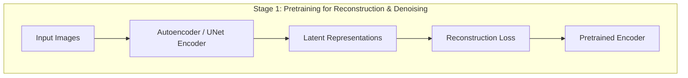
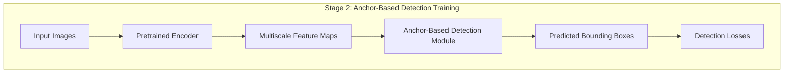
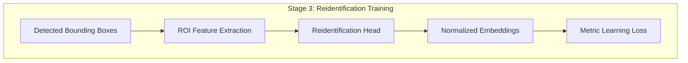
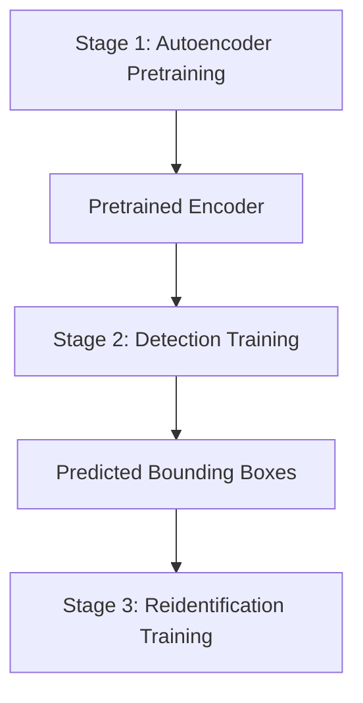
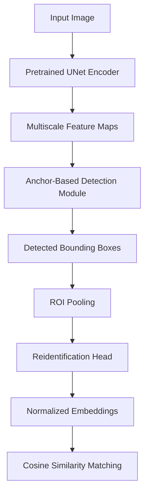

# Unified Object Detection and Reidentification Approach

This document details an integrated method extending the eyetoy architecture for object detection and reidentification. The system combines robust, pixel-level feature extraction with multiscale, anchor-based detection and produces compact, discriminative embeddings for reidentification via cosine similarity query.

---

## 1. Overview

The approach involves the following key components:

-**Autoencoder Pretraining:**

  The model is first trained as an autoencoder for reconstruction and denoising to learn a robust latent space.

-**UNet-Based Feature Extraction:**

  A UNet (or similar encoder-decoder) structure extracts detailed, pixel-level features while preserving spatial resolution.

-**Multiscale Anchor-Based Detection:**

  Multiscale features are fed to an anchor-based detection module that outputs bounding boxes for candidate objects.

-**Reidentification via ROI Pooling:**

  Detected bounding boxes are used to extract ROI features from the UNet encoder output, which are then passed through a reidentification head to generate normalized hash embeddings.

-**Unified End-to-End Pipeline:**

  The system is trained sequentially (or jointly) with losses for reconstruction, detection, and metric learning to ensure robust performance.

---

## 2. Architectural Components

### 2.1 Autoencoder / UNet Pretraining

-**Purpose:**

  Learn representations resilient to noise, ensuring the encoder can extract both low-level details and high-level semantic features.

-**Training:**

  Uses reconstruction and denoising losses in a self-supervised manner.

### 2.2 UNet-Based Feature Extraction

- A UNet (or modified encoder) preserves pixel-level details using skip connections.
- Produces multiscale feature maps used in subsequent detection stages.

### 2.3 Anchor-Based Multiscale Detection

-**Detection Module:**

  Incorporates multiple head groups, with each group focusing on specific scales.

-**Outputs:**

  -**Localization:** Regression layers predict bounding box coordinates.

  -**Classification:** Scores indicating object presence.

-**Anchors:**

  Predefined anchors with various scales and aspect ratios are used to cover a wide range of object sizes.

### 2.4 ROI Extraction and Reidentification Head

-**ROI Pooling:**

  Regions corresponding to detection bounding boxes are extracted from multiscale feature maps.

-**Reidentification:**

  A reid head generates compact embeddings (hash encodings) from these ROI features.

  The embeddings are normalized (e.g., L2-normalization) for cosine similarity based matching.

---

## 3. Training Pipeline

The training of the unified system can be decomposed into three major stages:

### Stage 1: Autoencoder Pretraining

-**Goal:** Learn a robust latent space for denoised representations.

### Stage 2: Detection Training

-**Approach:**

  The pretrained encoder supplies multiscale features to an anchor-based detection module.

-**Losses:**

  Combine bounding box regression loss (e.g., Smooth L1 or IoU loss) with classification loss.

### Stage 3: Reidentification Training

-**Process:**

  Use detected bounding boxes to extract ROI features which are then processed to generate reidentification embeddings.

-**Losses:**

  Apply metric learning losses (e.g., Triplet Loss, Contrastive Loss) to ensure discriminative embeddings.

### Integrated Training Diagram

---

## 4. Inference Pipeline

During inference, the system performs object detection and reidentification in a unified manner:

**Usage:**

-**Object Search and Tracking:**

  With the normalized embeddings as unique, searchable hash codes, the system can perform efficient object reidentification and tracking across frames or camera views.

-**Integration:**

  The pipeline can be exposed via a SaaS API or embedded into edge devices, serving applications such as surveillance, retail analytics, and smart city applications.

---

## 5. Detailed Pipeline Summary

1.**Input Stage:**

   Images are fed into the pre-trained autoencoder/UNet encoder, which produces dense latent representations.

2.**Detection Stage:**

   These representations are processed through multiscale attention and anchor-based mechanisms to identify and localize objects.

3.**Reidentification Stage:**

   Detected objects are further processed—using ROI pooling and a dedicated reid head—to generate robust and compact embeddings.

4.**Matching:**

   During deployment, cosine similarity on the normalized embeddings allows for the efficient search and retrieval of object identities.

---

## 6. Conclusion

The unified approach presented here leverages the synergy between fine-grained feature extraction, multiscale object detection, and robust reidentification. It presents a scalable, efficient, and accurate solution for modern computer vision tasks, suitable for both research settings and real-world applications such as surveillance, autonomous systems, and retail analytics.

Future work may include:

- Fine-tuning anchor configurations and loss weighting.
- Joint multi-task end-to-end training for detection and reidentification.
- Deployment optimizations for real-time or edge-based applications.
